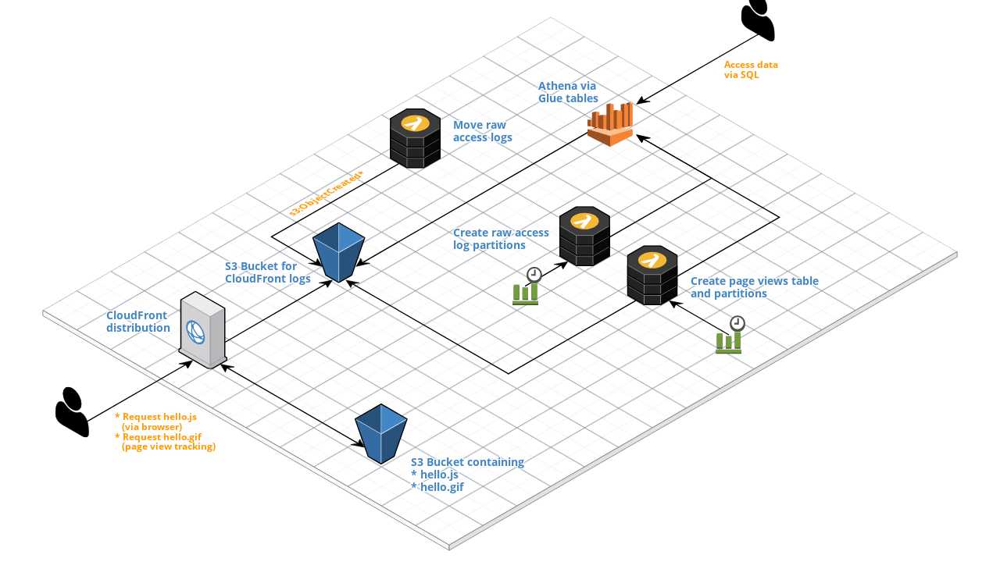

# ownstats
Host your own privacy-effective website statistics on AWS via CloudFront, S3, Glue and Athena.

## Architecture

[]()

### What is provisioned in your AWS account?
* A S3 bucket containing the assets for gathering website statistics (`hello.js` and `hello.gif`)
* A S3 bucket for the CloudFront CDN logs
* A CloudFront distribution for global hosting of the assets via CDN
* A Lambda function for automatic movement of the raw CloudFront logs into a folder structure which benefits Athena partitioning (see [functions/moveAccessLogs.js](functions/moveAccessLogs.js))
* A Lambda function which creates Athena partitions for the raw CloudFront logs (see [functions/createPartition.js](functions/createPartition.js))
* A Lambda function which transforms the raw CloudFront logs into a page view table, and also creates the relevant Athena partitions (see [functions/transformPartition.js](functions/transformPartition.js))
* A set of Glue tables  
  * `access_logs_raw`: Holds the raw CloudFront logs
  * `page_views`: Contains the page views derived from `access_logs_raw`
  * `edge_locations`: A list of CloudFront edge location, which can be used to get approximate location info for the `page_views` table (as IP information is dropped). See below for some usage information.

## Preconditions
This guide assumes that you have a pre-existing domain which you want to use for hosting your static website. Furthermore, you need to have access to the domain's DNS configuration.

Also, you need to have an install of [Serverless](https://www.serverless.com) on your machine.

## How-to 
To use `ownstats` on your websites, you can follow the steps below to get started.

### Set up a Serverless project
There are basically two ways to get started, either use [Serverless](https://www.serverless.com) to generate a basic project structure, or use the "traditional" fork and clone mechanisms.

#### Use Serverless templates
The following command will create a local project structure you can use to deploy your static website in the `ownstats-mywebsite` folder relative to your current working directory:

```bash
$ sls create --template-url https://github.com/ownstats/ownstats --path ownstats-mywebsite
Serverless: Generating boilerplate...
Serverless: Downloading and installing "ownstats"...
Serverless: Successfully installed "ownstats"
```

**Hint**  
When using this method, Serverless is replacing the `service.name` in the `serverless.yml` file automatically with `ownstats-mywebsite`. If you want to use a different stack name, you have to replace it manually. You also need to take care of that the stack name is using only allowed characters. When using the "Fork and clone" method below, the stack name is automatically derived from the domain name and sanitized regarding the allowed characters.

#### Fork and clone
Once you forked the repo on GitHub, you can clone it locally via

```bash
$ git clone git@github.com:youraccount/yourrepo.git
```

where `youraccount/yourrepo` needs to be replaced with the actual repository name of your forked repo.

### Install dependencies
To install the dependencies, do a 

```bash
$ npm i
```

After that, the project is usable.

### Deploy
You can deploy `ownstats` with the following command:

```bash
$ sls deploy --domain yourdomain.yourtld --stage dev
```

where `yourdomain.yourtld` needs to be replaced with your actual domain name. You can also specify a AWS region via the `--region` flag, otherwise `us-east-1` will be used. Furthermore, you can enable a debug mode for `hello.js` by specifying `--debug-mode true`.

## Usage

### Glue tables
You can use Athena to run queries on the automatically populating Glue tables

#### access_logs_raw
The `access_logs_raw` table consists of the following columns:

* year (string)
* month (string)
* day (string)
* hour (sting)
* date (date)
* date (date)
* time (string)
* location (string)
* bytes (bigint)
* requestip (string)
* method (string)
* host (string)
* uri (string)
* status (int)
* referrer (string)
* useragent (string)
* querystring (string)
* cookie (string)
* resulttype (string)
* requestid (string)
* hostheader (string)
* requestprotocol (string)
* requestbytes (bigint)
* timetaken (float)
* xforwardedfor (string)
* sslprotocol (string)
* sslcipher (string)
* responseresulttype (string)
* httpversion (string)
* filestatus (string)
* encryptedfields (string)

#### page_views
The `page_views` table consists of the following columns:

* year (string)
* month (string)
* day (string)
* hour (sting)
* date (date)
* time (string)
* edge_location (string)
* edge_location_prefix (string)
* bytes (bigint)
* host_name (string)
* url (string)
* status (int)
* referrer (string)
* user_agent (string)
* result_type (string)
* response_result_type (string)
* request_bytes (bigint)
* time_taken (float)
* x_forwarded_for (string)
* http_version (string)
* timezone (string)
* device_outer_resolution (string)
* device_inner_resolution (string)
* device_color_depth (int)
* device_platform (string)
* device_memory (int)
* device_cores (int)
* browser_language (string)
* source (string)
* utm_source (string)
* utm_campaign (string)
* utm_medium (string)
* utm_content (string)
* utm_term (string)

#### edge_locations
The `edge_locations` table consists of the following columns:

* edge_location_prefix (string)
* city (string)
* state (string)
* country (string)
* count (int)
* latitude (float)
* longitude (float)

It can be joined to the `page_views` table via the respective `edge_location_prefix` columns to add location information to the page view data.

### Querying via Athena

## Removal
You can remove the stack by running

```bash
$ sls remove --domain yourdomain.yourtld
```

**Hint**  
It's possible that you'll have to clean the S3 buckets manually before running the above command.
